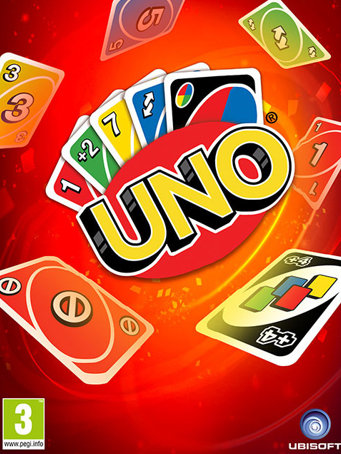

# My Favorite Activity: Board Games

I love playing board games, especially with family and friends. There's a wide variety of games to play, and each creates memories filled with fun, exciting, and hilarious experiences.

### 3 Reasons Why I Love Board Games
- Board games are **fun** because they are entertaining and engaging.
- Board games are **bonding** because they create a shared memory or experience, and are a form of spending quality time together.
- Board games are **competitive** because they require using skill and strategy to become the winner.

### My Top 5 Favorite Board Games
1. Uno
2. Spoons
3. Rummikub
4. Thirteen
5. Speed

### [How To Play Uno](https://www.youtube.com/watch?v=sWoSZmHsCls&ab_channel=wikiHow)
